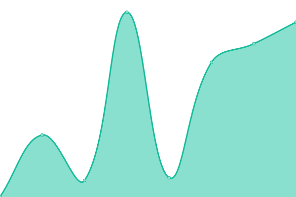
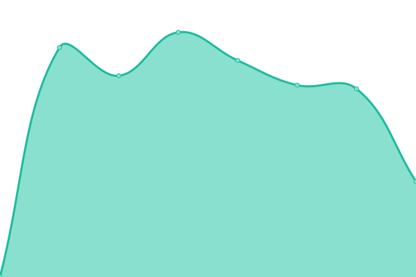
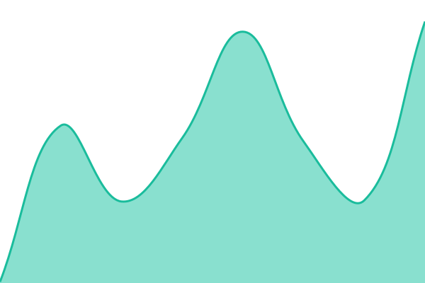
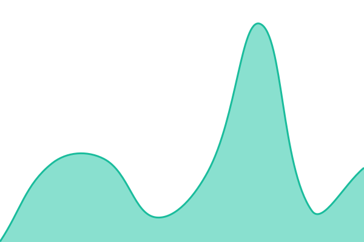
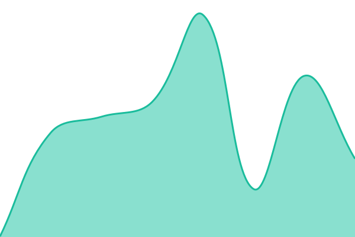

# [📈 Live Status](https://status.websiteos.ai): <!--live status--> **🟩 All systems operational**

This repository contains the open-source uptime monitor and status page for [Stef29](https://status.websiteos.ai), powered by [Upptime](https://github.com/upptime/upptime).

With [Upptime](https://upptime.js.org), you can get your own unlimited and free uptime monitor and status page, powered entirely by a GitHub repository. We use [Issues](https://github.com/Stef29/status-websiteos/issues) as incident reports, [Actions](https://github.com/Stef29/status-websiteos/actions) as uptime monitors, and [Pages](https://status.websiteos.ai) for the status page.

<!--start: status pages-->
<!-- This summary is generated by Upptime (https://github.com/upptime/upptime) -->
<!-- Do not edit this manually, your changes will be overwritten -->
<!-- prettier-ignore -->
| URL | Status | History | Response Time | Uptime |
| --- | ------ | ------- | ------------- | ------ |
|  [Marketing site](https://websiteos.ai) | 🟩 Up | [marketing-site.yml](https://github.com/Stef29/status-websiteos/commits/HEAD/history/marketing-site.yml) | 

 430ms
     
 | 

<a href="https://status.websiteos.ai/history/marketing-site">100.00%</a>
    

|  [Dashboard](https://app.websiteos.ai) | 🟩 Up | [dashboard.yml](https://github.com/Stef29/status-websiteos/commits/HEAD/history/dashboard.yml) | 

 884ms
     
 | 

<a href="https://status.websiteos.ai/history/dashboard">100.00%</a>
    

|  [Lead form page](https://websiteos.ai/get-started) | 🟩 Up | [lead-form-page.yml](https://github.com/Stef29/status-websiteos/commits/HEAD/history/lead-form-page.yml) | 

 150ms
     
 | 

<a href="https://status.websiteos.ai/history/lead-form-page">100.00%</a>
    

|  [Pricing page](https://websiteos.ai/pricing) | 🟩 Up | [pricing-page.yml](https://github.com/Stef29/status-websiteos/commits/HEAD/history/pricing-page.yml) | 

 189ms
     
 | 

<a href="https://status.websiteos.ai/history/pricing-page">100.00%</a>
    

|  [Unsubscribe endpoint](https://websiteos.ai/unsubscribe) | 🟩 Up | [unsubscribe-endpoint.yml](https://github.com/Stef29/status-websiteos/commits/HEAD/history/unsubscribe-endpoint.yml) | 

 200ms
     
 | 

<a href="https://status.websiteos.ai/history/unsubscribe-endpoint">100.00%</a>
    

|  [Resend webhook](https://websiteos.ai/api/webhooks/resend) | 🟩 Up | [resend-webhook.yml](https://github.com/Stef29/status-websiteos/commits/HEAD/history/resend-webhook.yml) | 

 154ms
     
 | 

<a href="https://status.websiteos.ai/history/resend-webhook">100.00%</a>
    

|  [Stripe webhook](https://websiteos.ai/api/webhooks/stripe) | 🟩 Up | [stripe-webhook.yml](https://github.com/Stef29/status-websiteos/commits/HEAD/history/stripe-webhook.yml) | 

 161ms
     
 | 

<a href="https://status.websiteos.ai/history/stripe-webhook">100.00%</a>
    

|  [Cal webhook](https://websiteos.ai/api/webhooks/cal) | 🟩 Up | [cal-webhook.yml](https://github.com/Stef29/status-websiteos/commits/HEAD/history/cal-webhook.yml) | 

 152ms
     
 | 

<a href="https://status.websiteos.ai/history/cal-webhook">100.00%</a>
    

<!--end: status pages-->

[**Visit our status website →**](https://status.websiteos.ai)

## 📄 License

- Powered by: [Upptime](https://github.com/upptime/upptime)
- Code: [MIT](./LICENSE) © [Anand Chowdhary](https://anandchowdhary.com), supported by [Pabio](https://pabio.com)
- Data in the `./history` directory: [Open Database License](https://opendatacommons.org/licenses/odbl/1-0/)
